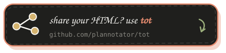

<p align="center">
  
</p>

# Effective HTML

Five focused skills for creating useful, self-contained HTML artifacts, from low-fidelity wireframes to working interactive prototypes.

The collection is opinionated about clarity, accessibility, and verification. It is not tied to one palette, typography stack, component system, or diagram style. Each artifact follows the user's direction first, then the project's established language, then the subject itself.

https://github.com/user-attachments/assets/24306977-7f30-44c9-9bff-55f901d557b0

<p align="center">
  <a href="https://github.com/backnotprop/plannotator">
    
  </a>
</p>
<p align="center">
Render and annotate local HTML with <a href="https://github.com/backnotprop/plannotator">Plannotator</a>.
</p>

## Choose a skill

| Skill | Use it for |
| --- | --- |
| [`html`](skills/html/SKILL.md) | Broad HTML requests, mixed artifacts, reports, explainers, presentations, landing pages, tools, and routing to a specialist |
| [`html-wireframe`](skills/html-wireframe/SKILL.md) | Low-fidelity layout directions that test content, hierarchy, navigation, flows, and responsive structure |
| [`html-prototype`](skills/html-prototype/SKILL.md) | Working prototypes with realistic states, interaction, keyboard support, and responsive behavior |
| [`html-plan`](skills/html-plan/SKILL.md) | Plans, roadmaps, rollouts, and implementation sequences that preserve source commitments |
| [`html-diagram`](skills/html-diagram/SKILL.md) | Architecture, sequence, process, state, hierarchy, timeline, and system diagrams |

## Install

Install the collection:

```bash
npx skills add plannotator/effective-html
```

List or install individual skills:

```bash
npx skills add plannotator/effective-html --list
npx skills add plannotator/effective-html --skill html-wireframe
npx skills add plannotator/effective-html --skill html-prototype
```

Invoke a skill directly:

```text
Use $html-wireframe to explore three responsive layouts for this checkout brief.

Use $html-prototype to make the checkout flow work, including validation, loading, failure, success, keyboard, and mobile states.
```

Only `$html` is eligible for implicit invocation. Call a specialist directly when you know the artifact type, or use `$html` to route a broad request. Each specialist remains independently usable when invoked directly.

### Claude Code plugin

```text
/plugin marketplace add plannotator/effective-html
/plugin install plannotator-effective-html@effective-html
```

### Codex plugin

```bash
codex plugin marketplace add plannotator/effective-html
codex plugin add plannotator-effective-html@effective-html
```

## How the skills work

The skills separate creative freedom from reliability:

- Visual direction comes from the conversation, project, audience, and subject.
- Wireframes stay intentionally unfinished so reviewers focus on structure.
- Prototypes implement one credible flow and its relevant states.
- Plans preserve source commitments.
- Diagrams choose a visual model and rendering method that fit the relationship being explained.
- Every artifact is responsive, accessible, self-contained, and verified in a browser.

Detailed guidance lives only where it is needed. The broad `html` skill keeps shared references for creative direction, documents, interfaces, diagrams, charts, and data. The specialist skills remain concise and independently usable.

## Repository shape

```text
skills/
├── html/
│   ├── SKILL.md
│   ├── agents/openai.yaml
│   └── references/
├── html-wireframe/
├── html-prototype/
├── html-plan/
└── html-diagram/

examples/
└── release-readiness/
    ├── brief.md
    ├── states.md
    ├── wireframe.html
    ├── prototype.html
    └── screenshots/
```

This project was inspired by Thariq Shihipar's [The unreasonable effectiveness of HTML](https://thariqs.github.io/html-effectiveness).

<p align="center">
  <a href="https://github.com/plannotator/tot">
    
  </a>
</p>
<p align="center">
Create a shareable link for an HTML file with <a href="https://github.com/plannotator/tot">tot</a>.
</p>
